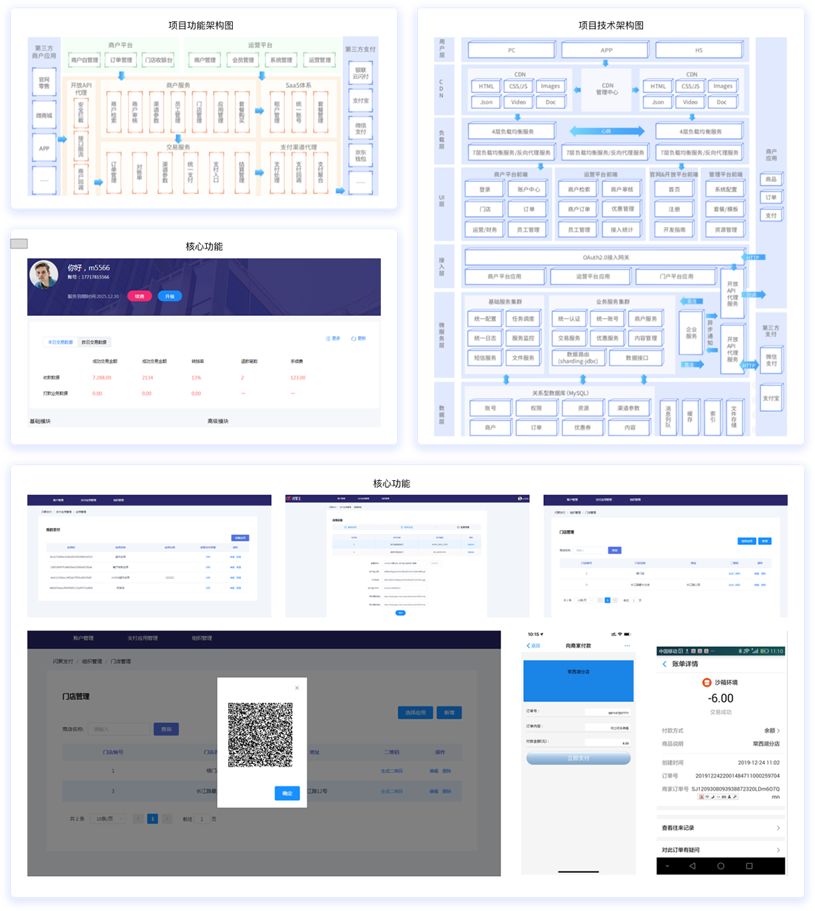

<div align="center">


# 🚀 闪聚支付  
**聚合支付平台 | 提供线上收银台、线下扫码支付、SaaS服务及全生态金融解决方案**  

<p align="center">
  <a href="https://gitee.com/itxinfei">
    
  </a> 
  <a target="_blank" href="https://qm.qq.com/cgi-bin/qm/qr?k=5iR4ej_YaZqZqCIRXwtN_-uF1JzBgw6v&jump_from=webapi&authKey=JKv1+3uSvDoBhZxQtg+9d4QCS88YdG9UBNUKhi2IyyxK/RvQ+zjn5WWdP1wkLMSC">
    
  </a>
  <a href="http://mail.qq.com/cgi-bin/qm_share?t=qm_mailme&email=f0hLSE9OTkdHTT8ODlEcEBI">
    
  </a> 
  
  
  
</p>
</div>


### 演示地址  
- **后台管理**：[运营平台](http://shanjupay-admin-java.itheima.net/#/operationLogin)  
- **商户平台**：[商户登录](http://shanjupay-main-java.itheima.net/#/login?redirect=%2F)  


## 📌 项目简介  
**闪聚支付** 是一个基于 **Spring Cloud Alibaba** 技术栈开发的聚合支付平台，旨在为商户提供 **一站式支付解决方案**。  
平台核心功能：  
- **线上聚合收银台**：整合主流第三方支付（如支付宝、微信）形成开放API  
- **线下C2B/B2C支付**：支持一码多付、商家扫码等场景  
- **SaaS服务**：提供订单管理、门店管理、财务统计等基础服务  
- **生态扩展**：通过广告、营销、金融服务构建移动支付全生态  


### 🎯 核心价值  
- **高可用性**：微服务架构支持水平扩展与容错  
- **灵活集成**：开放API适配多种商户需求  
- **数据驱动**：实时交易监控与多维度报表分析  

---

## 🧩 用户端口  
| 端口类型       | 功能描述                                                                 | 技术实现                  |
|----------------|--------------------------------------------------------------------------|---------------------------|
| **运营平台**   | 商户审核、权限配置、数据监控                                              | Vue + Spring Boot Admin   |
| **商户平台**   | 订单管理、门店设置、支付配置                                                | React + Ant Design        |
| **用户端App**  | 支付、账单查询、优惠券使用                                                  | Weex + WebSocket实时通知  |

---

## 📐 软件架构  
### 技术栈全景  
| 层级         | 技术选型                                                                 |
|--------------|--------------------------------------------------------------------------|
| **前端**     | Vue + React + Weex + ECharts                                           |
| **网关层**   | Spring Cloud Gateway + Sentinel                                         |
| **服务层**   | Spring Boot 2.7 + Dubbo 3.0 + MyBatis Plus                              |
| **消息队列** | RocketMQ 4.9                                                            |
| **数据层**   | MySQL 8.0 + Redis 6.2 + Sharding-JDBC                                  |
| **中间件**   | Nacos 2.1 + XXL-JOB                                                     |
| **监控**     | Prometheus + Grafana + SkyWalking                                       |

### 微服务架构详解  
  
**服务划分**：  
1. **用户中心**：商户注册、权限管理（RBAC模型）  
2. **交易服务**：支付订单生成、状态同步、对账处理  
3. **网关服务**：API路由、限流熔断、安全校验  
4. **配置中心**：Nacos动态配置管理  
5. **日志服务**：统一日志采集与异常监控  

---

## 🧱 数据库设计  
| 数据库名              | 数据量级     | 核心表设计                                                                 |
|-----------------------|--------------|----------------------------------------------------------------------------|
| `shanjupay_merchant_service` | 500万+       | 商户表（含资质审核、结算周期、费率配置）                                    |
| `shanjupay_transaction`      | 1亿+         | 订单表（按时间分表，Sharding-JDBC实现）                                     |

---

## 📁 项目结构  
### 核心模块说明  
#### 1. **商户平台应用** (`shanjupay-merchant-application`)  
- 前端界面：React实现商户后台管理  
- 接口调用：通过OpenFeign消费商户服务API  

#### 2. **商户服务API** (`shanjupay-merchant-api`)  
- 定义接口：`MerchantService`、`StoreService`  
- 依赖项：Swagger生成API文档，MyBatis Plus简化DAO操作  

#### 3. **商户服务实现** (`shanjupay-merchant-service`)  
- 核心逻辑：商户注册审核、门店管理、权限分配  
- 数据缓存：Redis存储商户配置（如支付渠道、费率）  

---

## 📊 整体业务流程  
1. **商户入驻**：提交资质 → 审核通过 → 分配API密钥  
2. **支付流程**：调用聚合收银台 → 选择支付方式 → 异步回调通知  
3. **对账机制**：每日定时任务对比三方支付与本地订单数据  
4. **分润计算**：基于交易金额与费率自动结算佣金  

---

## 📱 关注微信公众号  
  
**获取最新更新动态与技术支持文档**

---

## 📝 部署与依赖  
### 快速部署指南  
```bash
# 1. 安装依赖中间件
docker-compose up -d

# 2. 初始化数据库
mysql -u root -p shanjupay_merchant < sql/init_merchant.sql

# 3. 启动微服务
mvn clean install && java -jar shanjupay-gateway.jar
```


---
